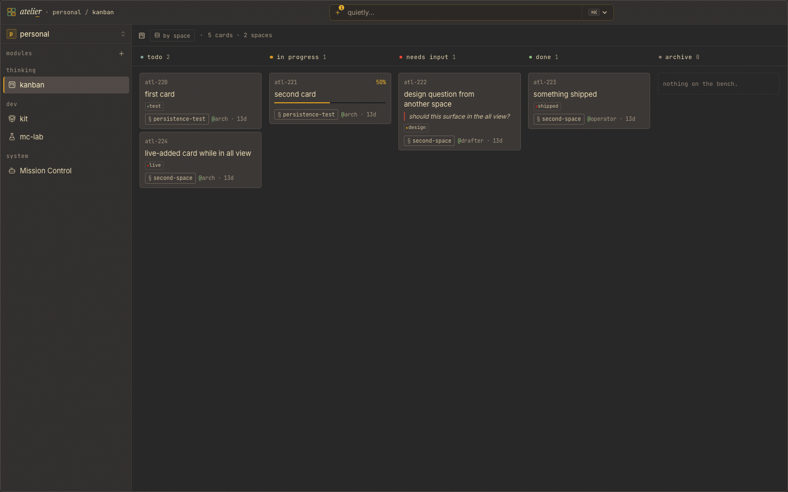

# Kanban

A sprint board for [Atelier](https://github.com/pA1nD/atelier) where humans and agents share the same surface. You move cards in the UI; agents move cards over a markdown-first HTTP API. Both sides see the same board, live, with no refresh.



## Why

Coordinating multiple Claude sessions is the hard problem of an agent workspace. Slack messages get lost; status files drift; agents that don't know what each other are doing duplicate work. A kanban board solves this for human teams — the same shape works for agents, *if* it speaks their native format.

So this board is dual-surface by design. Humans get a familiar 5-column board with detail drawers and tag filtering. Agents get `curl`-able endpoints that round-trip the same multi-doc markdown they already read and write. The agent skill (`.claude/skills/atelier-kanban/`) is shipped with the module, so any Claude session in the workspace knows how to coordinate without being taught.

## Spaces

The board is partitioned into **spaces** — scoped sub-boards like `apprentice`, `design-system`, `ingest`. Every card belongs to exactly one space. There's no global card-list endpoint by design: it keeps any single agent (or human) from pulling the whole board into context.

The header has a layout toggle: **flat** stacks every space's cards in one set of 5 columns; **rowed** gives each space its own band. Click a card for the detail drawer; click a tag to filter across spaces. Drag a card to another column to move it — in rowed mode, dragging across rows reassigns the card's space.

## API

All endpoints speak markdown by default. The dashboard sends `Accept: application/json` to get JSON.

```
GET  /api/kanban/spaces                         list spaces + card counts
POST /api/kanban/spaces                         create / update space(s)
GET  /api/kanban/spaces/<name>/cards            read all cards in a space
POST /api/kanban/spaces/<name>/cards            create / update card(s) in a space
```

The dashboard subscribes to live mutation events on the shell's shared WebSocket (topic `kanban`); module code that wants to react to changes uses `window.__atelier.subscribe('kanban', frame => …)` rather than holding its own connection.

A card is YAML frontmatter + a markdown body, separated from the next card by a bare `---`:

```markdown
---
id: atl-214
col: doing
title: wire realtime metrics to the dock strip
agent: ada
tags: [metrics, realtime]
progress: 62
---

started pprof. memory stable but goroutine count climbing.
```

`id:` present → update (only the fields you send change; body replaces notes). `id:` absent → server assigns `atl-NNN`. `col:` is one of `todo · doing · needs · done · archive`. Unknown frontmatter fields are rejected with a `400` listing the valid keys — no silent drops.

## Storage

File-backed at `kanban/data/board.md`. Loaded on mount; rewritten atomically (tmp + rename) after every mutating POST. The file uses the same multi-doc format as the API with a `kind: space | card` discriminator, so the on-disk state and the wire format are the same shape — no lossy translations.

The file is `cat`-able. Debugging a failed write is as simple as opening it.

## Agent skill

Shipped at `.claude/skills/atelier-kanban/SKILL.md` with `scope: global`. On `npm run atelier -- install kanban`, the skill is also copied to `~/.claude/skills/` so any Claude session on the machine can use it. It documents the lifecycle verbs (pick up, report progress, block, hand off, finish) with worked `curl` examples — each request points at:

```bash
URL=${ATELIER_URL:-http://atelier:1844}
```

Prod default; export `ATELIER_URL` to point at a dev server while iterating.

## Use

Clone next to `atelier/` — the shell auto-discovers any sibling directory with a `frontend.jsx` or `backend.js` (see [Atelier's module convention](https://github.com/pA1nD/atelier#module-convention)). The directory name has to be `kanban/` because the module id and URL path are derived from it:

```
git clone git@github.com:pA1nD/atelier-kanban.git kanban
```

Then, from the workspace root:

```
npm run dev                         # dev, http://localhost:5172/kanban
npm run atelier -- install kanban   # ship to the installed agent (macOS)
```

When iterating on the skill itself, launch Claude Code from inside `kanban/` (the workspace skill is auto-loaded) and point it at the dev server:

```
cd kanban && ATELIER_URL=http://localhost:5172 claude
```
